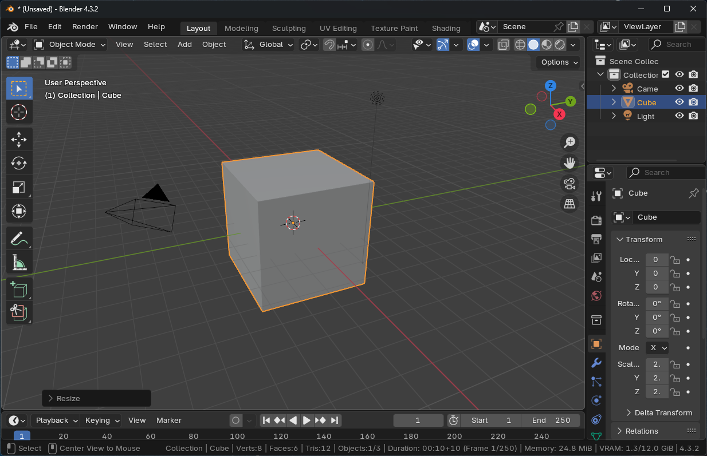

1000 Hours of Blender - (H0 - 10)

Now and again I get interested in learning to use 3D software. I've done a few Blender (open-source 3D software) courses in the past but none of the things I have learned have seemed to stick since I don't use the software regularly. Last week I tried to set up a simple scene as a reference for an illustration I was working on and was shocked that I didn't even remember how to move a cube around in the 3D space.

#### Why 3D?

One of the main reasons I'm looking into 3D software is because lately I just haven't been enjoying illustration as much, and I feel stuck with my current style. Drawing has never really been my thing naturally - most of my illustrations are actually just me piecing things together in Illustrator until they work. My process has always been more about methodically constructing images than drawing freehand. I spend hours tweaking and adjusting elements until they look right, building up an image out of separate elements. And honestly, I enjoy that 'building' process way more than traditional drawing. What I'm wondering is if the constructive nature of 3D modeling might align better with how I naturally approach visual creation, potentially offering me a new path forward.

#### 1000 Hours

Because I've tried Blender a few times before and then dropped it, I've decided to commit to spending at least a thousand hours learning Blender.

#### First project - Modeling architecture

For my first project, I'm working on something that is actually very helpful at the moment. My wife, who lives in Japan, and I are looking for a rental house in the Tokyo area. The average apartment in Tokyo is a lot smaller than what I am used to where I live. For one house that we are deciding on, I'm using the blueprint to make a model to scale, fitting in all the things we want and getting a better picture. 

The first 10 hours in Blender have mostly been getting to know some of the basic navigation, modeling some walls and placing some downloaded assets. I barely have an idea of what I am doing, but at least it's helping us get an idea of the spaces we are looking at."

Tags: blender
