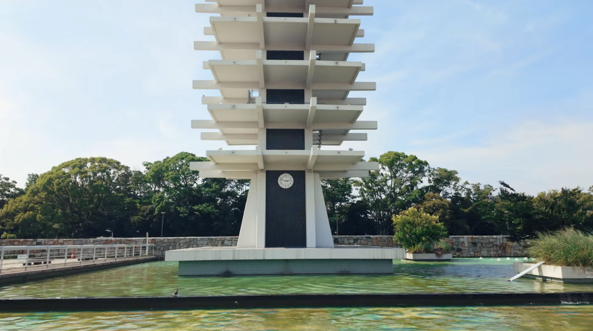
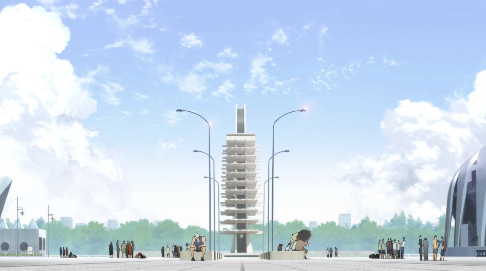
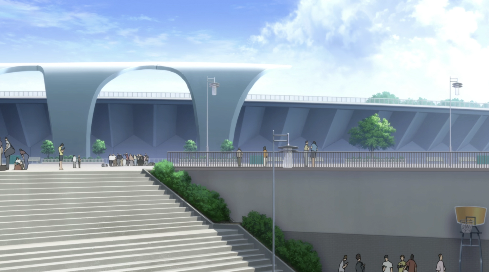
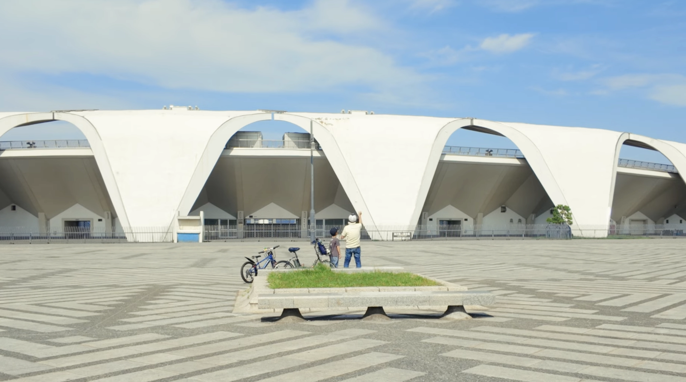
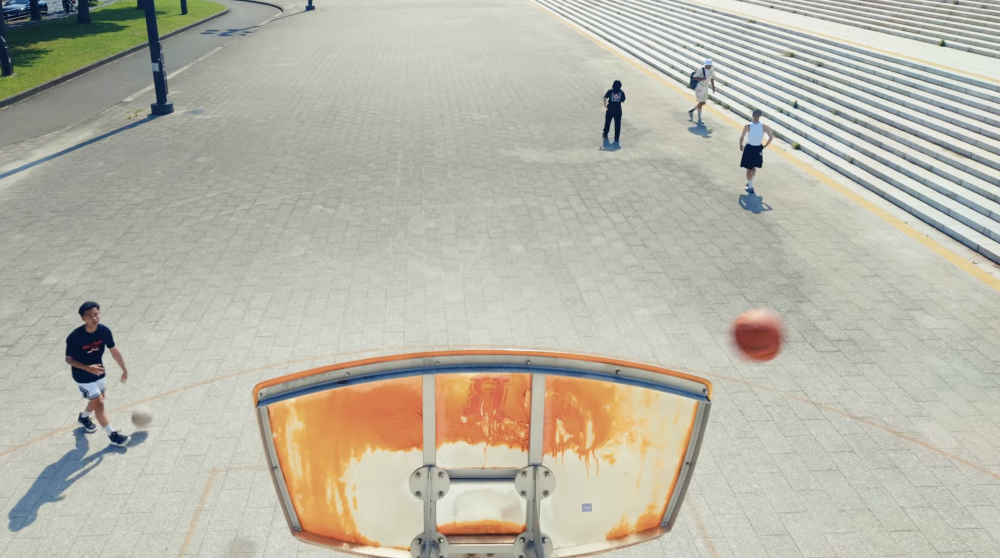

A Familiar Place in "Japan Sinks: 2020"

Yesterday I started watching [Japan Sinks: 2020](https://www.imdb.com/title/tt12031040/), a mini-series based on the novel [Japan Sinks](https://en.wikipedia.org/wiki/Japan_Sinks) by [Sakyo Komatsu](https://en.wikipedia.org/wiki/Sakyo_Komatsu). To be honest, the first episode was a real bummer for someone who is planning a move to Japan. However, I was pleasantly surprised to see some familiar buildings and locations in the opening scenes. Last June, [I filmed my first video](./i-made-my-first-youtube-video.html), and one of its locations - which I accidentally stumbled upon during my walks - was Komazawa Olympic Park.

#### Komazawa Olympic Park Control Tower
When I arrived at the park, I was immediately drawn to the Komazawa Olympic Park Control Tower. I'd never heard of it before but later found out that it was designed by the celebrated architect Yoshinobu Ashihara for the 1964 Tokyo Olympics.  Its structure refers to traditional Japanese wood architecture, but it's executed in a unique, concrete modernist style. Because it's so tall, it's the only shot I made during my trip where I panned the camera vertically. For the final video, I used a static shot of the bottom part since all the other shots were static. However, in the still from the anime, you can see the structure in its entirety.

*Still from Japan Sinks: 2020, (S1.E1 The Beginning of the End)*

#### Olympic Park Stadium and Basketball Court

Adjacent to the Control Tower stands the Komazawa Olympic Park Stadium, also from 1964 but designed by Masachika Murata. Nowadays it's used as a multi-purpose stadium, mostly for football and rugby matches. This location plays an important part in the first episode of Japan Sinks. If you walk down the steps behind the stadium, you will get to the basketball court. You can see the orange basket in the bottom right corner of the anime screengrab—the same orange basket which I shot while extending my arm through the railing from above.
*Still from Japan Sinks: 2020, (S1.E1 The Beginning of the End)*
*A grandfather and grandson share a playful moment as they fly a toy airplane together*

I've only seen the first episode so far but I am enjoying the show, even if it's just for looking out for places I recognize.

Tags: guide