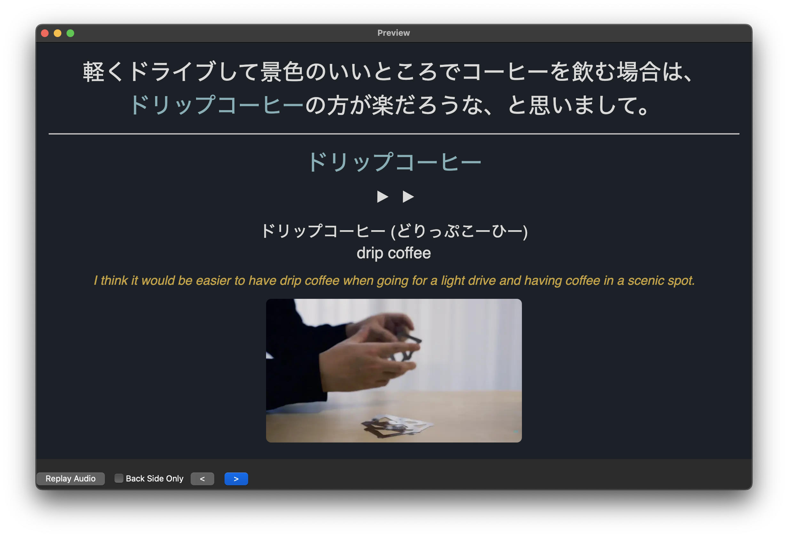

Coffee Confusion

This morning, I decided to get regular coffee instead of my usual café latte at Tully’s. I was already a bit thrown off to learn that what they call “drip coffee” is just regular coffee that comes out of a machine—not hand-poured or anything fancy. But what really confused me was the Japanese menu, where “drip coffee” was labeled as 日本のコーヒー, which literally means “Japanese coffee.”

I tried saying “drippu kōhī” (ドリップコーヒー), and that worked just fine, so it seems like that’s the standard term.

Out of curiosity, I looked up where this “Japanese coffee” label might come. Even ChatGPT doesn’t seem entirely sure why drip coffee was labeled that way in this case. Anyhow, I ended up sentence-mining a few coffee-related expressions. Obviously, these are easy [katakana](./how-i-learned-the-kana.html) words that I don't necessarily need to add to my flashcards, but I've found it helpful to hear the audio every now and then for words I frequently use in daily conversation.

*ChatGPT*

*via: https://www.youtube.com/watch?v=VZ16eqDVk3c&t=45s*

*via: https://www.youtube.com/watch?v=3r7cRS0w5MU&t=175s*

Tags: japanese
