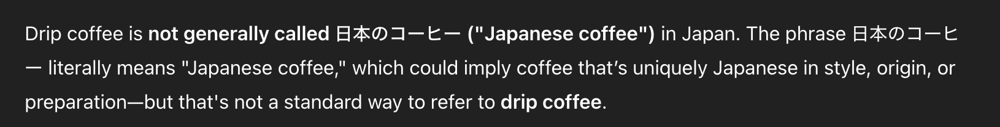

Coffee Confusion at Tully's

This morning, I decided to get regular coffee instead of my usual café latte at Tully’s. I was already a bit thrown off to learn that what they call “drip coffee” is just regular coffee that comes out of a machine—not hand-poured or anything fancy. But what really confused me was the Japanese menu, where “drip coffee” was labeled as 日本のコーヒー, which literally means “Japanese coffee.”

Not sure how to order, I tried saying “drippu kōhī” (ドリップコーヒー), and that worked just fine.

Out of curiosity, I looked up where this “Japanese coffee” label might come. Even ChatGPT doesn’t seem entirely sure why drip coffee was labeled that way in this case.

**! UPDATE**

As I was talking about this with my wife later today, she pointed out that the kanji 本日 in this case is read as honjitsu, meaning “today.” So 本日のコーヒー means “today’s coffee,” referring to the specific beans being used that day.

Since 本日 can also be read as Nihon (“Japan”), I had initially interpreted it as “Japanese coffee,” but honjitsu makes much more sense in this context. That said, it would still feel a bit odd to order “today’s coffee,” so you’d probably just say “hot coffee” or “drippu kōhī” (ドリップコーヒー) when ordering.

*via: https://www.youtube.com/watch?v=VZ16eqDVk3c&t=45s*

Tags: japanese, vocabulary, mining
