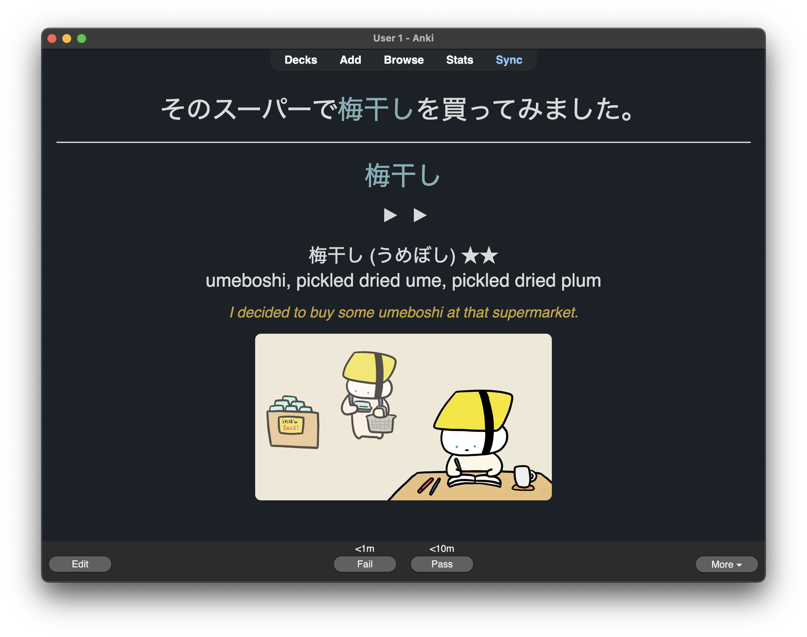

Learn Japanese with Tanaka san

I've been sentence mining some new vocabulary words today from the beginner-friendly YouTube channel [Learn Japanese with Tanaka san](https://www.youtube.com/@japanese_tanakasan) and wanted to share it here as I think it's a great channel. Right now I have about 80-90% word comprehension on most videos, which is perfect as I understand most of what is being said but am still picking up some new, high-frequency words. Oh, and I like the cute illustrated characters too.

*One of the cards I made today*

Tags: japanese