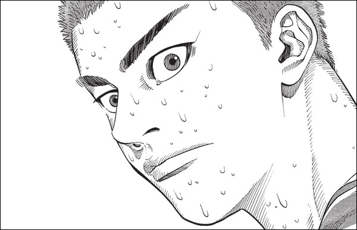

Realizing I Need Grammar

Not knowing much grammar is becoming a real problem—something I’ve been really noticing now that I’ve moved to Japan. I had hoped to pick it up naturally through immersion, but since I’ve spent most of my time reviewing and adding new vocabulary and kanji readings, I feel like I’m missing the glue that holds everything together. It’s frustrating that I can’t form meaningful sentences when talking to people I meet. Even though I know a large number of isolated words, I still struggle to put them together in a way that makes sense. Just the other day, I met the owner of the izakaya next door, and when he started asking me questions about just moving here, I broke out in a sweat—I couldn’t find a way to respond beyond a few awkward words and gestures. In a way, when it comes to actual communication, I don’t feel much more advanced than I was two years ago.

*img: slam dunk*

Tags: japanese