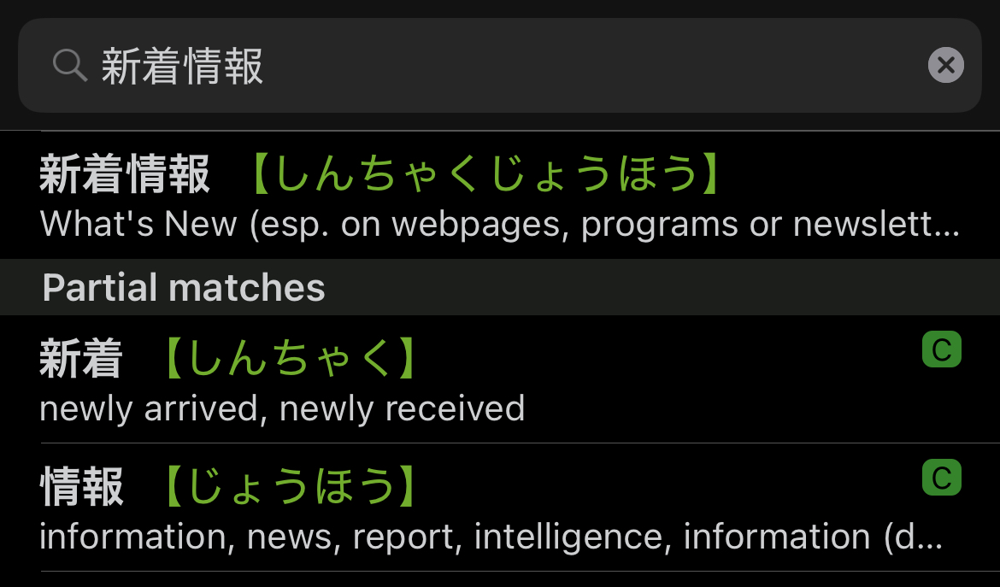

Sentence Mining Spam Messages

A few days ago, I signed up for the JRE Card, which is a point card linked to my Suica travel card. Basically, I can earn points at most shops around the station by purchasing things like coffee. These points can then be used for travel discounts. I hastily set up the app and accidentally gave it permission to send all types of notifications—resulting in a constant stream of spam. However, rather than getting annoyed by it, I turned it into a little game: as soon as I fully understand the spam message, I allow myself to turn it off.

This spam message is perfect for sentence mining—it contains only one (compound) word I didn’t know yet: 新着情報.

*I use the app Shirabe Jisho on my iPhone to quickly look up words—either by taking a photo of the text, selecting the text in the image using Apple’s OCR and copying it into the app, or by drawing the kanji directly into the app.*

It turns out these are two separate words ("newly" and "information"), but when used together as a compound, they mean something like “what’s new.” It’s commonly used on news websites and in apps.

Then, I create an Anki card that includes the sentence, target word, and additional details like audio for both the sentence and the word. While it's possible to do this directly in Anki, I’ve found that [Migaku’s](https://migaku.com/) card creator works great—it automatically generates the audio files.

With a click of a button, the card is created and sent to Anki, where it becomes part of my learning routine.

Tags: japanese, sentence-mining
