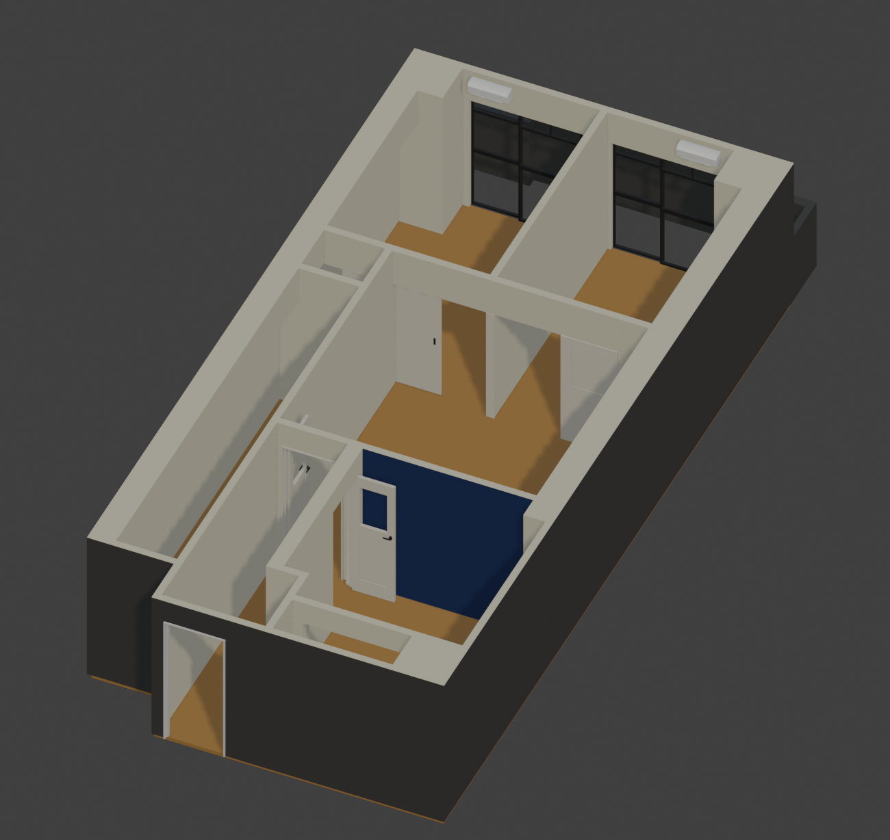
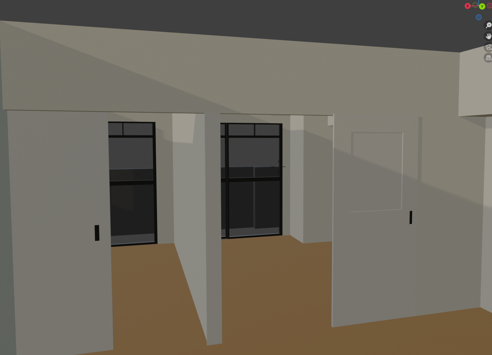

The First 10 Hours in Blender

For my first project, I'm working on something that is actually very helpful at the moment. My wife, who lives in Japan, and I are looking for a rental house in the Tokyo area. The average apartment in Tokyo is a lot smaller than what I am used to where I live. For one house that we are deciding on, I'm using the blueprint to make a model to scale, fitting in all the things we want and getting a better picture.

The first 10 hours in Blender have mostly been getting to know some of the basic navigation, modeling some walls and placing some downloaded assets. I barely have an idea of what I am doing, but at least it's helping us get an idea of the spaces we are looking at.

Tags: blender